# Zadanie 6

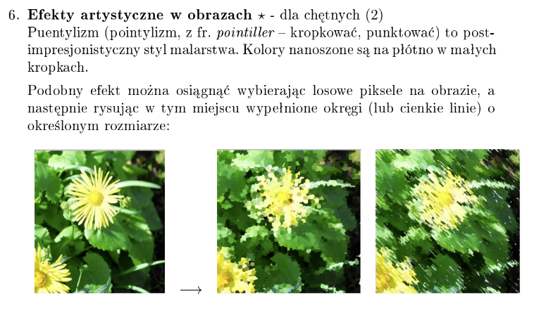

Wykorzystując macro `puentylizm.txt` wybieramy losowe piksele z obrazu oraz wykorzystując funkcję `fillOval` rysujemy kółka uzyskując efekt podobny do puentylizmu

| Oryginalny obraz | Użycie macro 1 raz | Użycie macro 4 razy |
| --- | --- | --- |
|  |  | 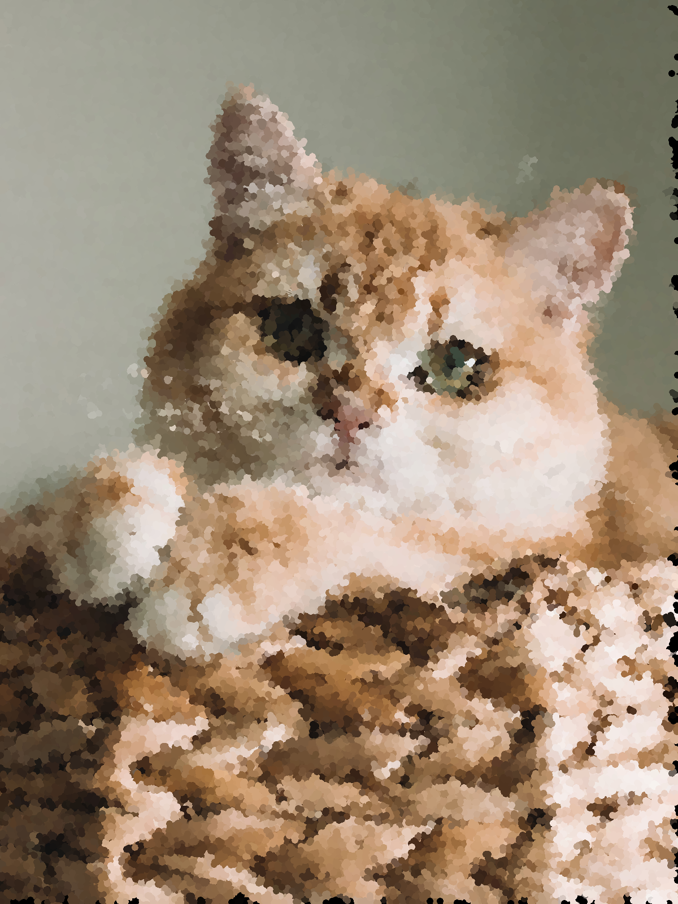 |

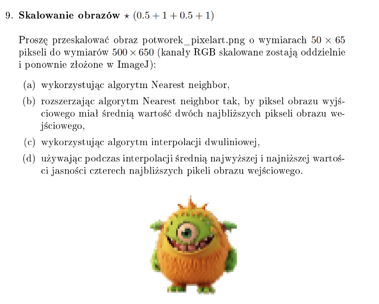

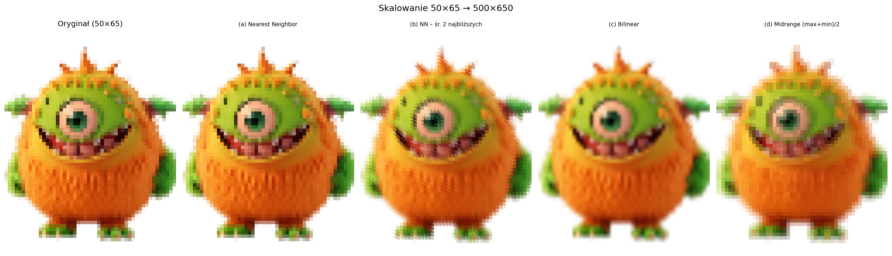

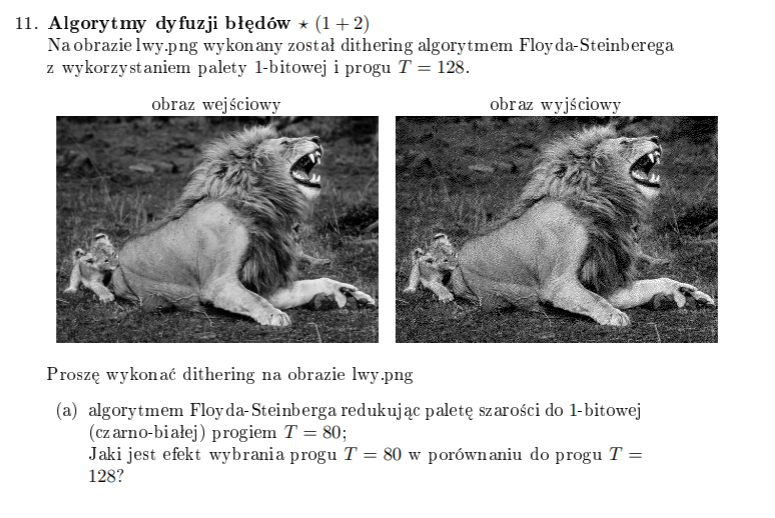
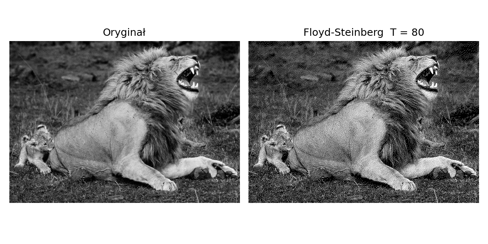

Dithering Floyd-Steinberg z progiem 80 powoduje, że algorytm „przepuszcza" białe piksele agresywniej – obraz wynikowy jest globalnie jaśniejszy, z większą gęstością białych punktów w ciemniejszych obszarach

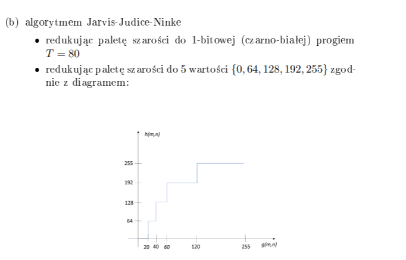
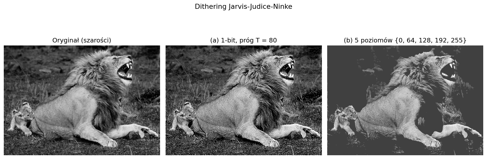

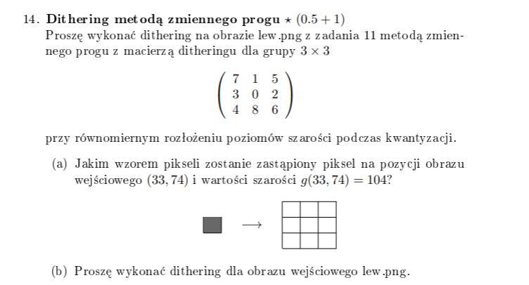
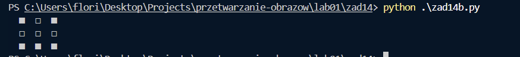
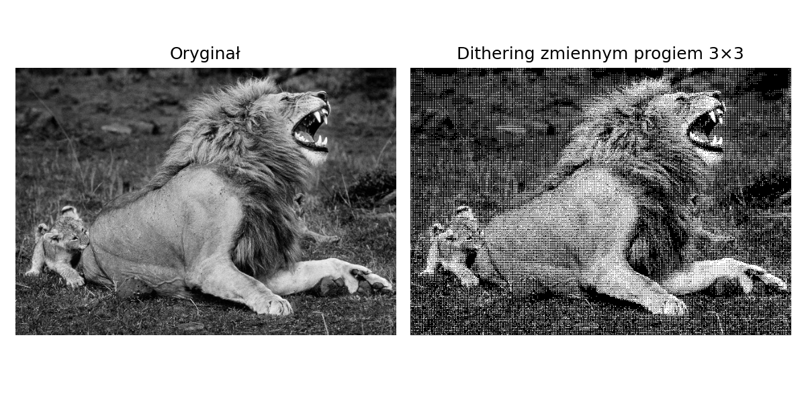

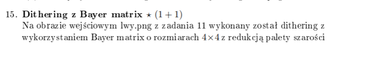
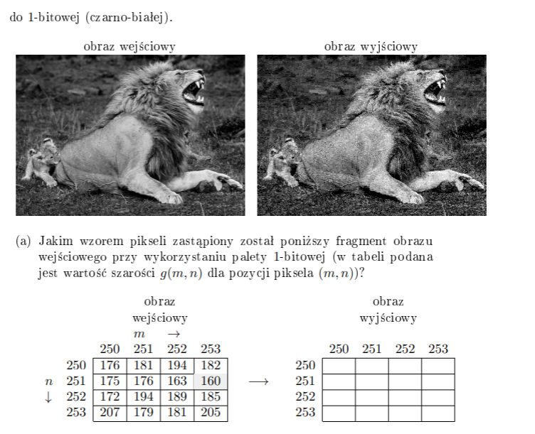
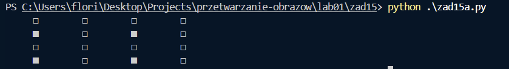
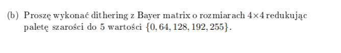
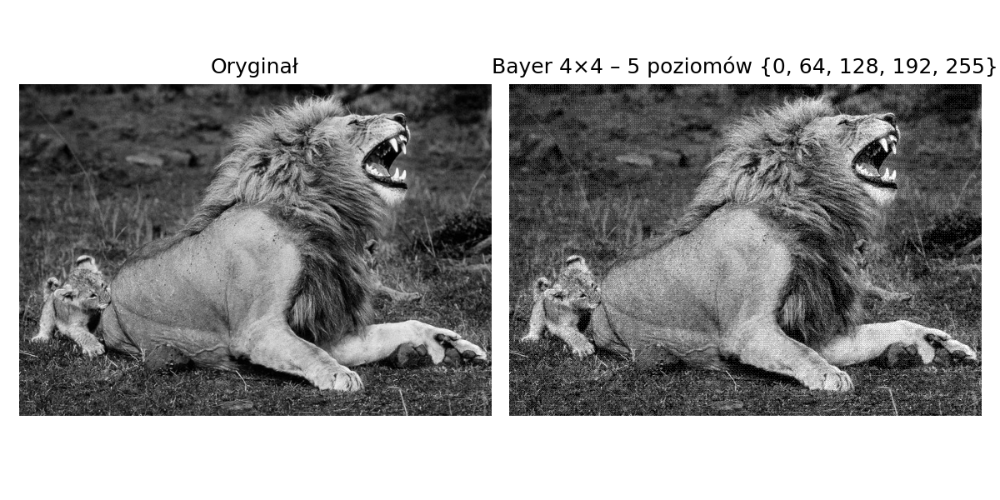