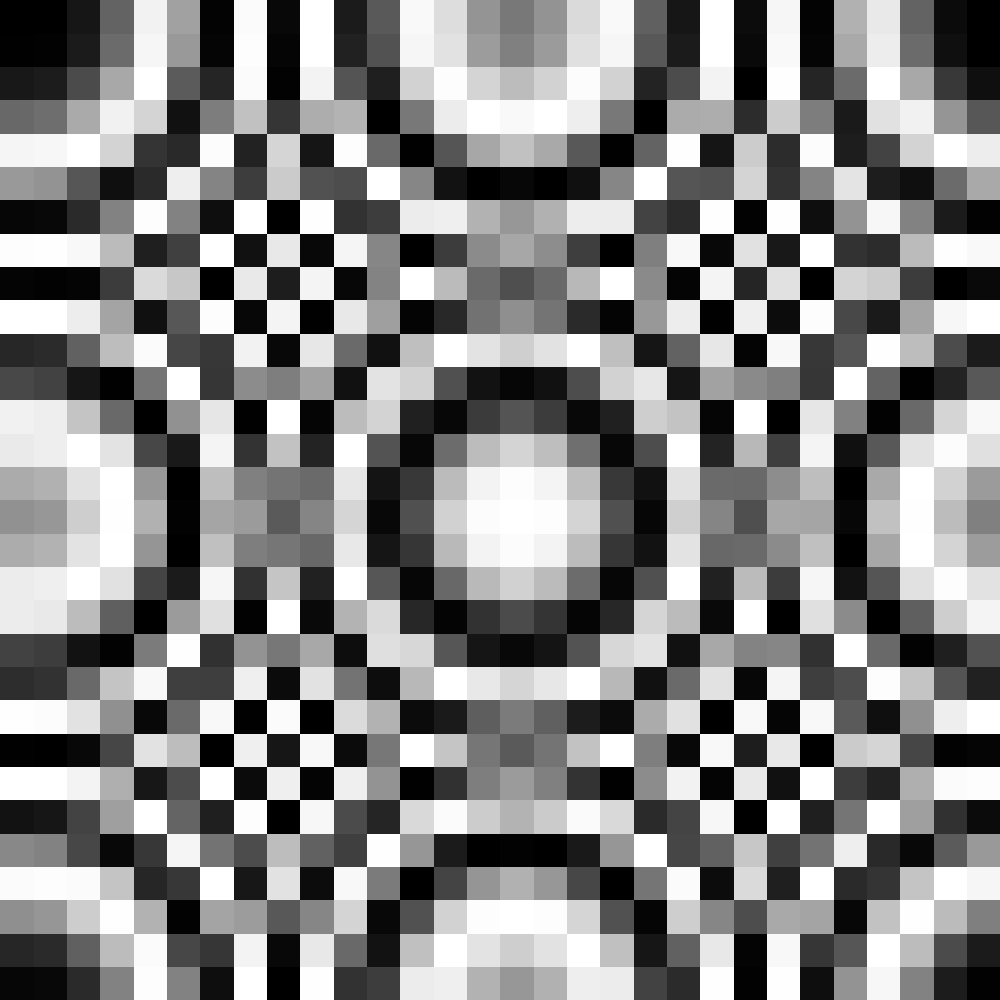

# Zad1

### Pkt a)


Dla próbkowania co 50px punkty próbkowania trafiają w strefę aliasingową i zrekonstruowany sygnał będzie tam zniekształcony. Środkowa część znajduje się w strefie, gdzie rekonstrukcja będzie możliwa. Minimalna częstotliwość, aby próbkować obraz, by jego rekonstrukcja była możliwa wynosi ok. 30px.

### Pkt b)

Na zrekonstruowanym obrazie widoczne są dwa główne efekty.
Pierwszym jest efekt bloków pikselowych widoczny w całym obrazie gdzie każda próbka została powiększona do jednolitego kwadratu bez interpolacji, co daje charakterystyczny "schodkowy" wygląd. Drugim jest aliasing widoczny na obrzeżach obrazu w postaci fałszywego wzoru szachownicowego. Pierścienie Fresnela są tam tak gęste, że próbkowanie jest zbyt rzadkie.

### Pkt c)




# Zad2


min = 0
max = 255

```
Kontrast globalny = (255 - 0) / 255 = 1
```

```
Kontrast lokalny = 2.156
```


```
Kontrast globalny = (255 - 0) / 255 = 1
```
```
Kontrast lokalny = 2.023
```


```
Kontrast globalny = (214 - 41) / 255 ~ 0.678
```
```
Kontrast lokalny = 1.458
```

# Zad3

### PNG -> GIF


`Średnia: 97.320`

### PNG -> JPG


`Średnia: 15.889` <- Lepsza wartość

# Zad4


Widmo obrazu A posiada dominującą oś poziomą odpowiadającą pionowym pasom koszuli, podczas gdy w widmie B oś ta jest wyraźnie obrócona zgodnie z kątem nachylenia materiału. Dodatkowe rozmyte promienie w obu widmach wynikają z różnej orientacji prążków na kołnierzyku i mankietach względem głównej części tkaniny.


# Zad5

### Pkt a)


### Pkt b)


Zjawisko widoczne na profilach liniowych to efekt Gibbsa. Objawia się on charakterystycznymi oscylacjami (tętnieniami) jasności w pobliżu krawędzi paska.