# Zad1

### Progowanie Otsu (dwuklasowe)

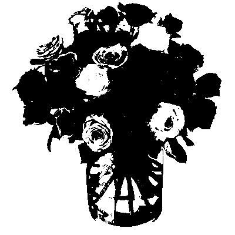

### Iteracyjne progowanie trójklasowe Otsu

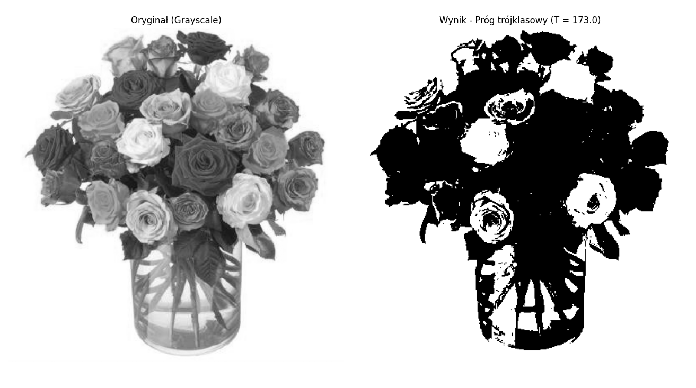

Algorytm iteracyjny progowania trójklasowego rozpoczyna od globalnego progu Otsu, a następnie w każdej iteracji wyznacza średnie tła i obiektu, po czym analizuje piksele z klasy pośredniej (między tymi średnimi), wyliczając nowy próg Otsu tylko na nich. Warunkiem stopu jest |ΔT| < 2. Dzięki temu próg lepiej dopasowuje się do pikseli pogranicza niż zwykłe Otsu.

### Segmentacja metodą sąsiedztwa

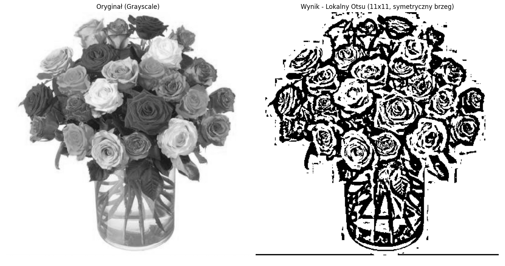

# Zad2

### Histogram i histogram skumulowany

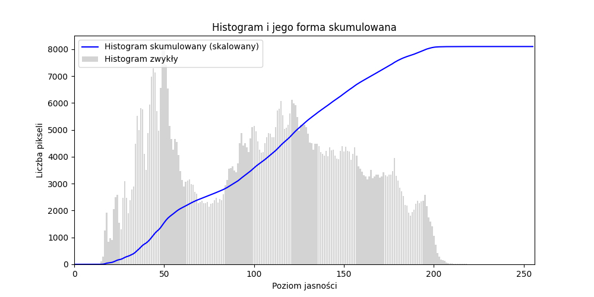

### Wyrównanie histogramu

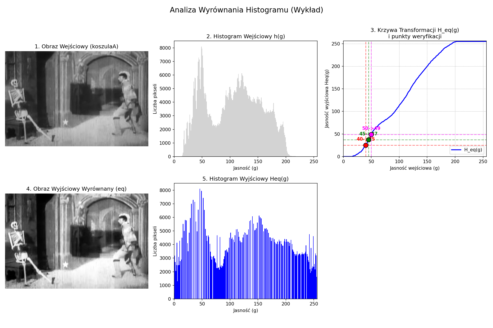

Weryfikacja wartości wejściowych g -> Heq(g):
  40 -> 25
  45 -> 37
  50 -> 49

### Hiperbolizacja histogramu

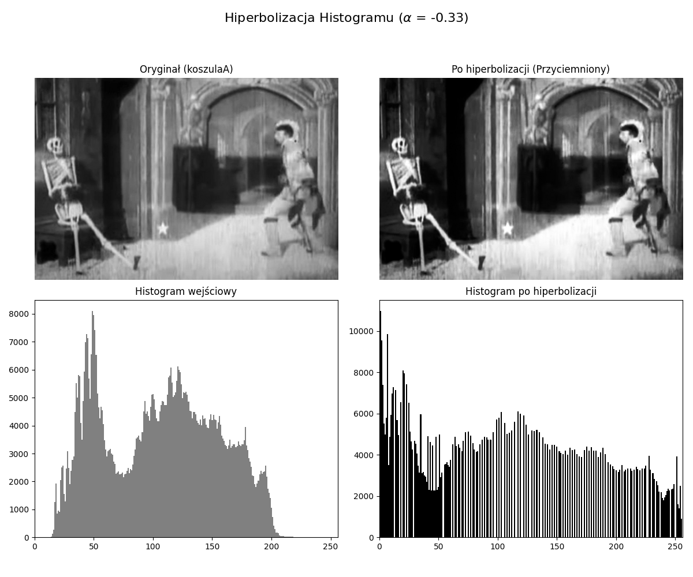

Wyniki Hhyper(g) dla alpha = -1/3:
  g = 40 -> Hhyper(g) = 8
  g = 45 -> Hhyper(g) = 14
  g = 50 -> Hhyper(g) = 21

# Zad3

### Zwiększenie kontrastu poprzez zastosowanie kolorów

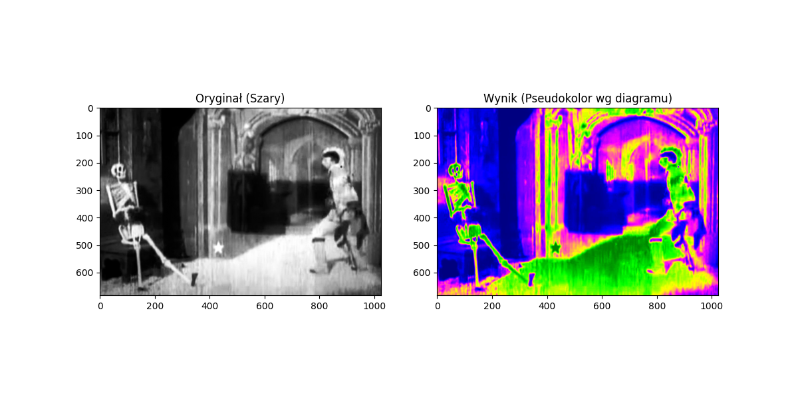

# Zad4

### Poprawa kontrastu Całunu Turyńskiego

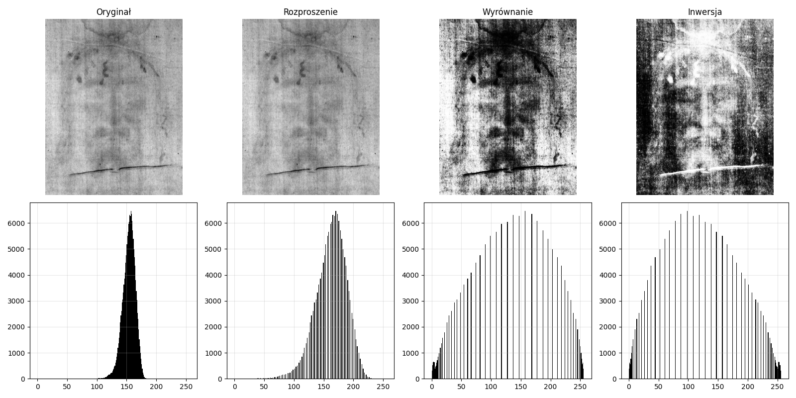

Zestawienie trzech operacji punktowych zastosowanych do obrazu `CalunTurynski.png`:
- **Rozproszenie** — liniowe rozciągnięcie
- **Wyrównanie histogramu** — pełne spłaszczenie histogramu
- **Inwersja** — negatyw obrazu po wyrównaniu

Najczytelniejszy rezultat daje inwersja po wyrównaniu histogramu — ciemne oblicze zostaje przedstawione jako jasna postać na ciemnym tle, co odpowiada sposobowi, w jaki faktycznie widoczna jest postać na całunie.

# Zad5

### (a) Wzmocnienie krawędzi na czerwono

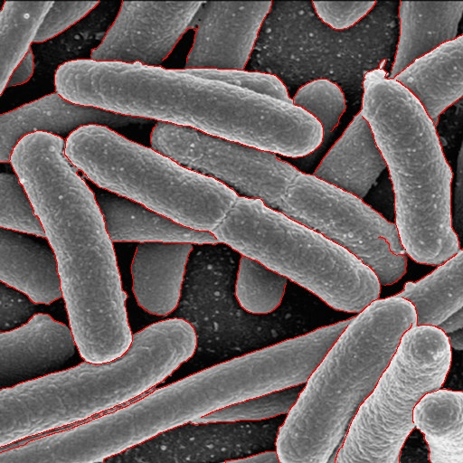

Z szarego obrazu bakterii utworzono obraz RGB. Następnie do kanału czerwonego zastosowano **dodawanie obrazów** mapy krawędzi, a od kanałów zielonego i niebieskiego **odjęto** tę samą mapę krawędzi. W miejscach krawędzi kanał R nasyca się do 255, natomiast G i B spadają do 0, dzięki czemu obwódki bakterii są czerwone.

### (b) Wzmocnienie krawędzi na turkusowo

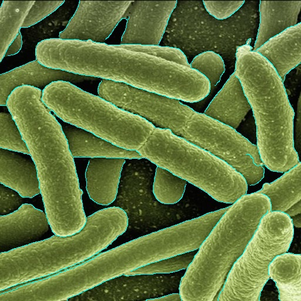

Na kolorowym obrazie bakterii wykonano **operację ¬** na mapie krawędzi, uzyskując jej negację. Następnie kanał czerwony połączono z zanegowaną mapą przez **operację ∧**, a kanały zielony i niebieski z oryginalną mapą przez **operację ∨**. W efekcie w miejscach krawędzi R = 0 oraz G = B = 255, więc obwódki bakterii są cyjanowe (turkusowe).

# Zad6

### Okienkowanie, wygładzanie i korekcja gamma

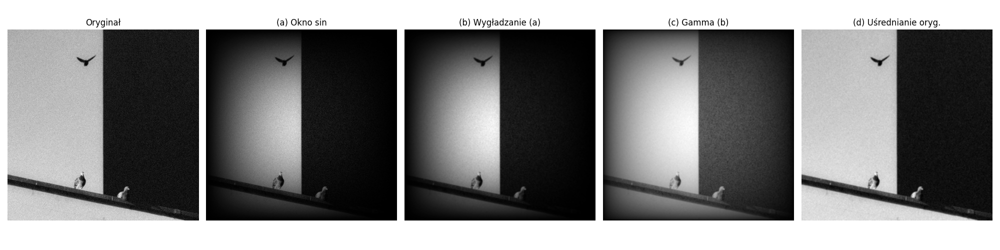

# Zad7

### Steganografia LSB

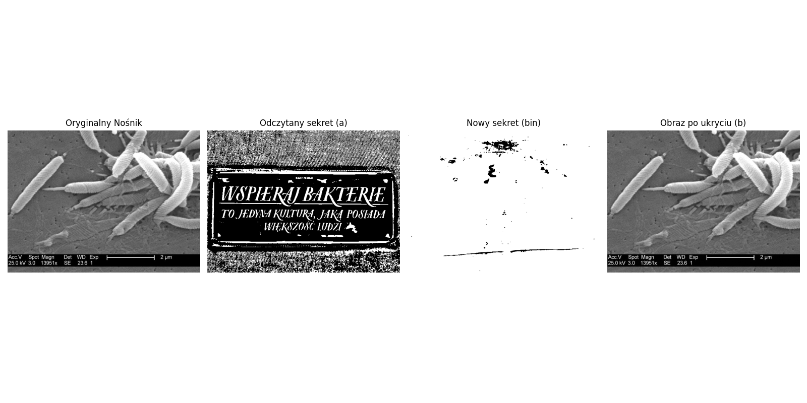

Obraz z ukrytą nową wiadomością:

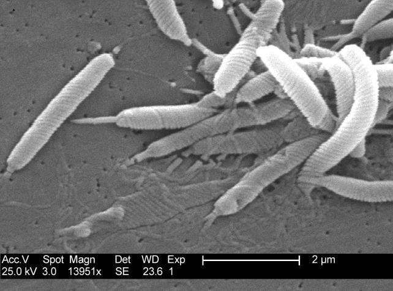
